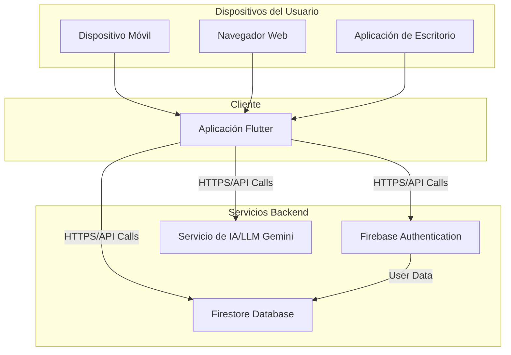

```mermaid
graph TD
    subgraph Dispositivos del Usuario
        A[Dispositivo Móvil]
        B[Navegador Web]
        C[Aplicación de Escritorio]
    end

    subgraph Cliente
        D[Aplicación Flutter]
    end

    subgraph Servicios Backend
        E[Firebase Authentication]
        F[Firestore Database]
        G[Servicio de IA/LLM Gemini]
    end

    A --> D
    B --> D
    C --> D

    D -- HTTPS/API Calls --> E
    D -- HTTPS/API Calls --> F
    D -- HTTPS/API Calls --> G

    E -- User Data --> F
```

