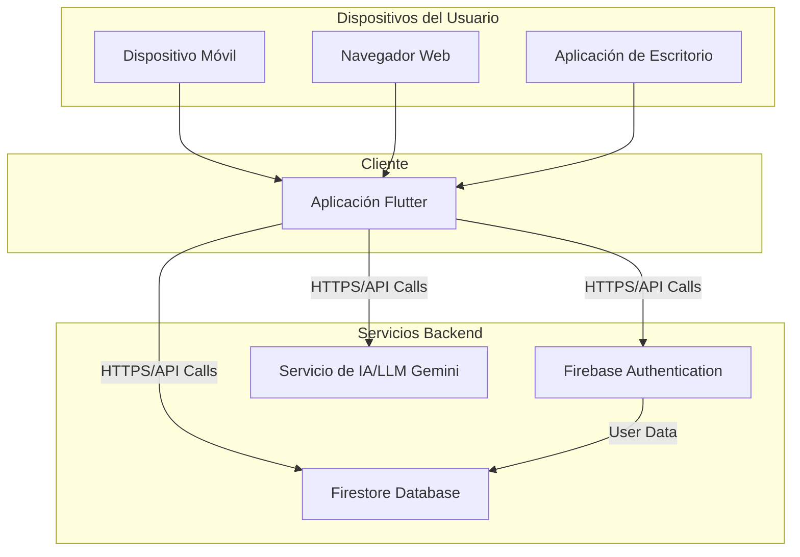

```
packageDiagram
    direction LR

    package l10n {
        class app_es_arb
        class app_en_arb
    }

    package common {
        // Vacío por ahora
    }

    package chat {
        // Vacío por ahora
    }

    package calendar {
        // Vacío por ahora
    }

    package auth {
        // Vacío por ahora
    }

    class Main {
        +runApp()
    }

    class FirebaseOptions {
        // Opciones de configuración de Firebase
    }

    %% Relaciones entre paquetes y clases

    Main --> l10n
    Main --> common
    Main --> calendar
    Main --> auth

    Main --> FirebaseOptions
```