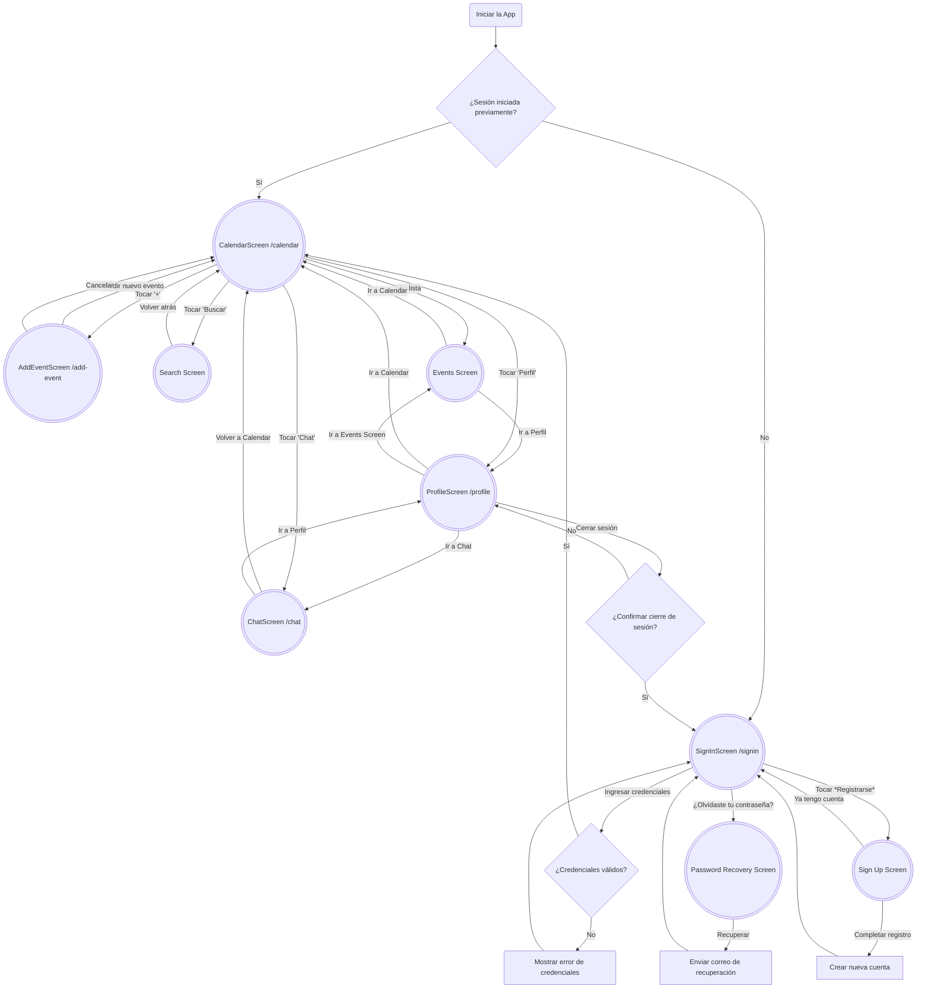

```mermaid
graph TD
    A(Iniciar la App) --> B{¿Sesión iniciada previamente?}
    B -- Sí --> C(((CalendarScreen /calendar)))
    B -- No --> D(((SignInScreen /signin)))
    D -- "Ingresar credenciales" --> E{¿Credenciales válidos?}
    D -- "¿Olvidaste tu contraseña?" --> O(((Password Recovery Screen)))
    O -- "Recuperar" --> P[Enviar correo de recuperación]
    P --> D
    E -- Sí --> C
    E -- No --> F[Mostrar error de credenciales]
    F --> D
    D -- "Tocar *Registrarse* " --> G(((Sign Up Screen)))
    G -- "Completar registro" --> H[Crear nueva cuenta]
    H --> D
    G -- "Ya tengo cuenta" --> D
    C -- "Tocar '+'" --> I(((AddEventScreen /add-event)))
    I -- "Añadir nuevo evento" --> C
    I -- "Cancelar" --> C
    C -- "Tocar 'Buscar'" --> J(((Search Screen)))
    J -- "Volver atrás" --> C
    C -- "Ver lista" --> L(((Events Screen)))
    L -- "Ir a Perfil" --> K(((ProfileScreen /profile)))
    L -- "Ir a Calendar" --> C
    C -- "Tocar 'Perfil'" --> K
    K -- "Ir a Calendar" --> C
    K -- "Ir a Events Screen" --> L
    K -- "Ir a Chat" --> N(((ChatScreen /chat)))
    K -- "Cerrar sesión" --> Q{¿Confirmar cierre de sesión?}
    Q -- Sí --> D
    Q -- No --> K
    C -- "Tocar 'Chat'" --> N
    N -- "Volver a Calendar" --> C
    N -- "Ir a Perfil" --> K
```