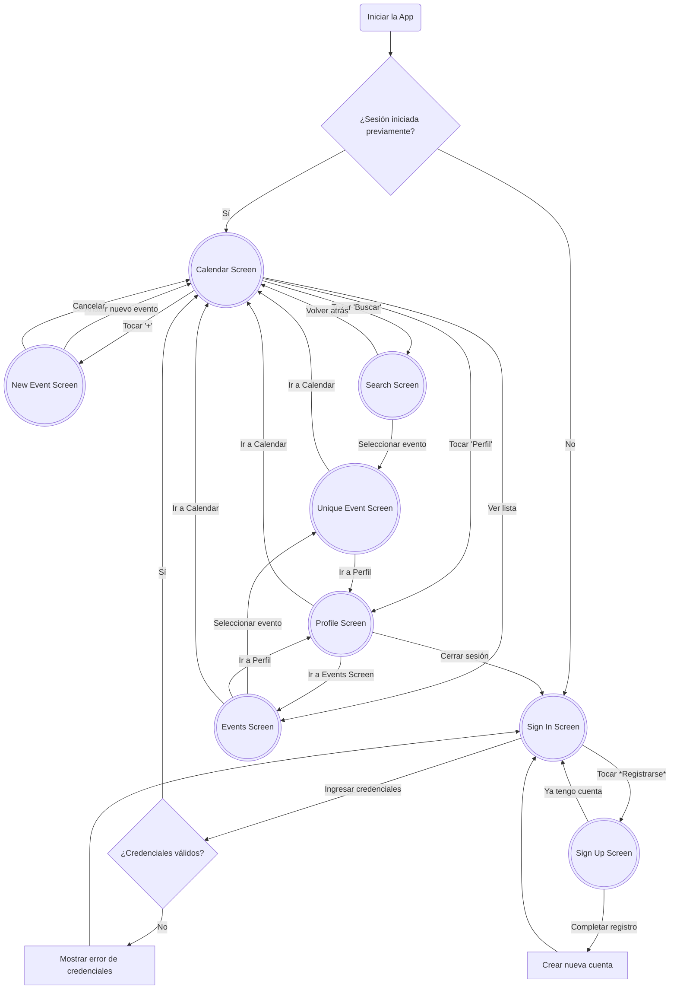

```mermaid
graph TD
    A(Iniciar la App) --> B{¿Sesión iniciada previamente?};
    B -- Sí --> C(((Calendar Screen)));
    B -- No --> D(((Sign In Screen)));
    D -- "Ingresar credenciales" --> E{¿Credenciales válidos?};
    E -- Sí --> C;
    E -- No --> F[Mostrar error de credenciales];
    F --> D;
    D -- "Tocar *Registrarse* " --> G(((Sign Up Screen)));
    G -- "Completar registro" --> H[Crear nueva cuenta];
    H --> D;
    G -- "Ya tengo cuenta" --> D;
    C -- "Tocar '+'" --> I(((New Event Screen)));
    C -- "Tocar 'Buscar'" --> J(((Search Screen)));
    C -- "Tocar 'Perfil'" --> K(((Profile Screen)));
    C -- "Ver lista" --> L(((Events Screen)));
    I -- "Añadir nuevo evento" --> C;
    I -- "Cancelar" --> C;
    J -- "Seleccionar evento" --> M(((Unique Event Screen)));
    J -- "Volver atrás" --> C;
    L -- "Seleccionar evento" --> M;
    L -- "Ir a Perfil" --> K;
    L -- "Ir a Calendar" --> C;
    M -- "Ir a Perfil" --> K;
    M -- "Ir a Calendar" --> C;
    K -- "Ir a Calendar" --> C;
    K -- "Ir a Events Screen" --> L;
    K -- "Cerrar sesión" --> D;
```